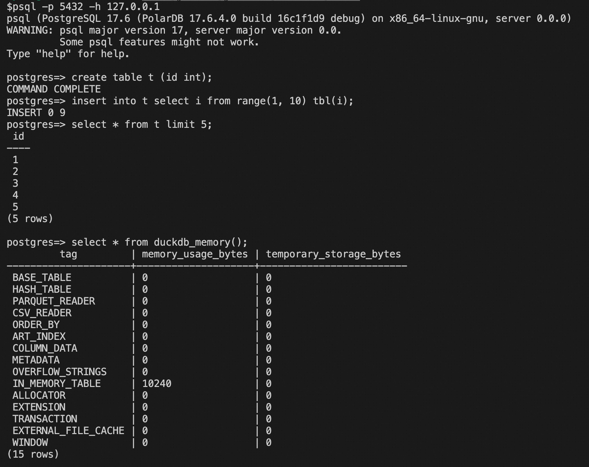

#  PostDuck
[](https://github.com/fanvanzh/PostDuck/actions/workflows/cmake-multi-platform.yml)

Make DuckDB run as Postgresql-Server



## Feature RoadMap
Postgresql protocal:
- [x] Simple Query
- [ ] Query Cancel
- [ ] Prepare Stmt
- [ ] Binary Result

Compatible with PG tools:
- [x] psql
- [x] pgbench
- [ ] pg_dump
- [ ] pg_restore

Compatible with PG drivers:
- [ ] pgx
- [ ] psycopg2
- [ ] libpq/libpqxx
- [ ] PostgreSQL JDBC Driver

## Build and run
### Install Boost Library
Centos:
```
yum install boost-devel
```
Ubuntu:
```
sudo apt update
sudo apt install libboost-all-dev
```
Mac:
```
brew install boost
```

### Clone Source
```
git clone --recurse-submodules https://github.com/fanvanzh/PostDuck
```

### Build
```
cd PostDuck
mkdir build && cd build
cmake ..
make -j 16
```
### Run
```
./postduck --help
```