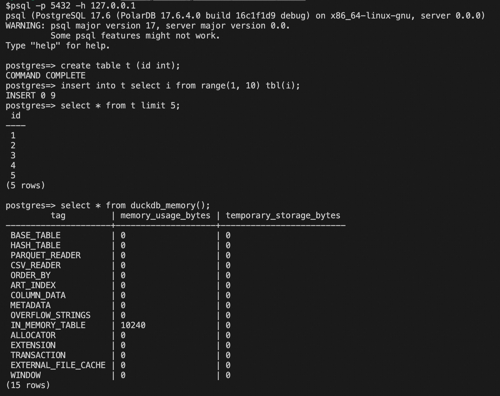

# PostDuck
[](https://github.com/fanvanzh/PostDuck/actions/workflows/cmake-multi-platform.yml)

Make DuckDB run as a PostgreSQL-Server — connect to DuckDB with any tool in the
Postgres ecosystem (psql, pgbench, libpq, psycopg2, JDBC, …) and query/insert
data using the Postgres wire protocol v3.



## Feature RoadMap

### PostgreSQL wire protocol
- [x] Simple Query protocol (`Q`)
- [x] Extended Query protocol (`P`/`B`/`D`/`E`/`C`/`S`/`H`)
- [x] ParameterStatus / BackendKeyData / ReadyForQuery
- [x] ErrorResponse with SQLSTATE
- [x] Text format parameters and results
- [x] Binary format parameters (bool/int2/int4/int8/float4/float8 + fallback)
- [x] Binary format results (bool/int2/int4/int8/float4/float8 + fallback)
- [x] Empty query / multi-statement queries (CommandComplete per statement)
- [x] SSL negotiation (rejected with `N`, connection continues in plaintext)
- [x] Query cancel (CancelRequest + `Connection::Interrupt`)
- [x] Column metadata with real PG type OIDs derived from DuckDB `LogicalType`
- [x] Correct per-statement tags (`SELECT n`, `INSERT 0 n`, `UPDATE n`, `DELETE n`, …)
- [ ] COPY protocol (used by `pg_dump`/`pg_restore`/`pgbench -i` data-load)
- [ ] Notification (`LISTEN`/`NOTIFY`)

### Compatible with PG tools
- [x] **psql** – simple + extended query, `\d`-style introspection via rewrites
- [x] **pgbench** – simple / extended / prepared modes (custom scripts and built-in TPC-B)
- [x] **libpq / psycopg2** – extended protocol, parameterized prepared statements
- [x] **PostgreSQL JDBC Driver** – connect, execute, prepared statements, `DatabaseMetaData` (tables/schemas/columns)
- [ ] pg_dump / pg_restore (require COPY protocol)

### PG dialect rewrites
When a client sends a Postgres-only construct that DuckDB cannot parse, the
server rewrites it on the fly. This includes:
- `SET <unknown_guc> = ...` → no-op
- `BEGIN [WORK|TRANSACTION ISOLATION LEVEL ...]` → `BEGIN;`
- Multi-object `DROP TABLE a, b, c` → separate `DROP TABLE` statements
- Multi-table `TRUNCATE a, b, c` → separate `DELETE FROM` statements
- JDBC `DatabaseMetaData.getTables / getSchemas / getColumns` catalog queries
  are mapped to DuckDB's `duckdb_tables()`, `duckdb_schemas()`,
  `duckdb_views()`, and `information_schema.columns`.
- Automatic recovery from DuckDB's `current transaction is aborted` state.

## Build and run

### Install Boost
CentOS:
```
yum install boost-devel
```
Ubuntu:
```
sudo apt update
sudo apt install libboost-all-dev
```
Mac:
```
brew install boost
```

### Clone the source (with DuckDB submodule)
```
git clone --recurse-submodules https://github.com/fanvanzh/PostDuck
```

### Build
```
cd PostDuck
mkdir build && cd build
cmake ..
make -j 16
```

### Run
```
./postduck --help
./postduck --port 5432 --data /var/lib/postduck --thread 8 --log INFO
```

`--data` selects the directory where DuckDB database files (`<dbname>.db`)
are created on first connection. `<dbname>` comes from the client's startup
packet (`-d` in `psql`, `database=` in JDBC, …).

### Tests

Integration tests live under [`test/`](./test). They start a real `postduck`
binary, connect with `psycopg2`, and exercise the wire protocol end-to-end.

```bash
pip install -r test/requirements.txt
# rebuild first, then:
./test/run_tests.sh -v         # or: pytest -v test/
```

See [`test/README.md`](./test/README.md) for details.

### Try it out
```
# psql
psql -h 127.0.0.1 -p 5432 -U postduck -d mydb

# pgbench
pgbench -h 127.0.0.1 -p 5432 -U postduck -d mydb -i --init-steps=dt --no-vacuum
pgbench -h 127.0.0.1 -p 5432 -U postduck -d mydb -n -c 4 -t 1000 -M prepared

# psycopg2
python3 -c "import psycopg2; \
  c=psycopg2.connect(host='127.0.0.1',port=5432,user='postduck',dbname='mydb'); \
  cur=c.cursor(); cur.execute('SELECT %s::int + %s::int', (10,20)); print(cur.fetchone())"

# JDBC
jdbc:postgresql://127.0.0.1:5432/mydb
```
